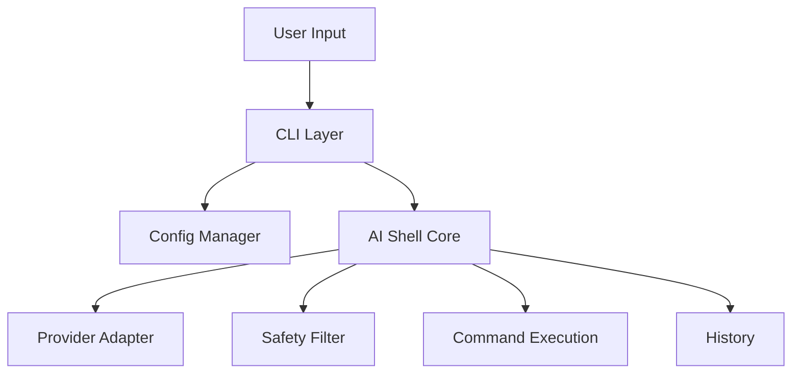

# ai-shell Architecture Overview

## Overview

`ai-shell` is a modular, extensible Node.js CLI tool that converts natural language into shell commands using multiple AI providers (OpenAI, Anthropic, Google, Ollama, etc.).

## Key Components

- **CLI Layer (`src/cli.js`)**: Handles user input, argument parsing, and orchestrates the workflow.
- **AI Shell Core (`src/ai-shell.js`)**: Manages provider selection, command conversion, safety checks, and execution.
- **Providers (`src/providers/`)**: Pluggable adapters for each AI provider. Each implements a common interface.
- **Config Manager (`src/config.js`)**: Handles user configuration, provider/model selection, and API key storage.
- **History (`src/history.js`)**: Manages command history in a local JSON file.
- **Docs (`docs/`)**: Project documentation and guides.

## Extending Providers

To add a new provider:
1. Create a new file in `src/providers/` (e.g., `myprovider-provider.js`).
2. Extend `BaseProvider` and implement `convertToCommand` and `getCommandExplanation`.
3. Register your provider in `src/providers/index.js`.
4. Add provider info to `src/config.js`.

## Flow Diagram

## Safety & Security
- All commands are filtered for dangerous patterns before execution.
- API keys are stored locally in user config, not in code.

## Testing & Development
- Use the `dev` branch for new features.
- Add tests and update docs for new features/providers.

---

For more, see [CONTRIBUTING.md](../CONTRIBUTING.md) and [README.md](../README.md). 