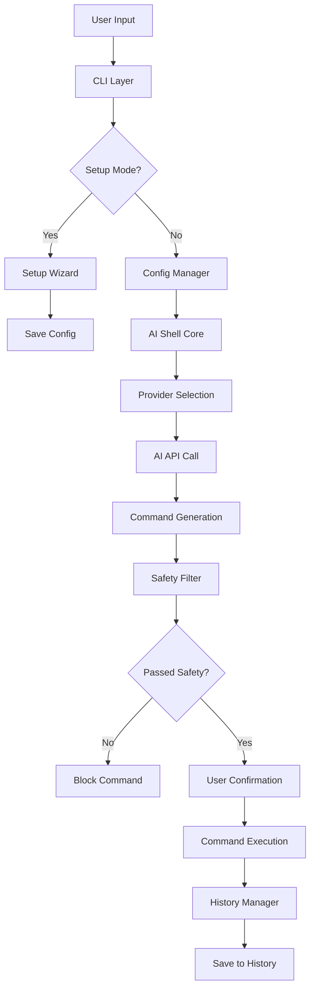

# NLShell Architecture Overview

## Overview

`NLShell` is a modular, extensible Node.js CLI tool that converts natural language into shell commands using multiple AI providers (OpenAI, Anthropic, Google, Ollama, etc.).

## Key Components

- **CLI Layer (`src/cli.js`)**: Handles user input, argument parsing, setup wizard, and orchestrates the workflow.
- **AI Shell Core (`src/ai-shell.js`)**: Manages provider selection, command conversion, safety checks, and execution.
- **Configuration Manager (`src/config.js`)**: Handles user configuration, provider/model selection, API key storage, and setup wizard logic.
- **History Manager (`src/history.js`)**: Manages command history in a local JSON file with timestamps and provider tracking.
- **Documentation (`docs/`)**: Project documentation, guides, and templates.

## Multi-Provider Architecture

NLShell supports multiple AI providers through a unified interface:

### Supported Providers
- **OpenAI**: GPT-4, GPT-3.5-turbo
- **Anthropic**: Claude-3-Sonnet, Claude-3-Haiku
- **Google**: Gemini Pro
- **Ollama**: Local models (llama2, codellama, etc.)

### Provider Integration
Each provider is integrated directly in `src/ai-shell.js` with:
- Provider-specific API calls
- Error handling
- Model selection
- Rate limiting considerations

## Flow Diagram



## Configuration System

### Configuration Storage
- **Location**: `~/.nlshell-config.json`
- **Format**: JSON with provider, API key, and model settings
- **Security**: API keys stored locally, not in code

### Setup Wizard
Interactive setup process that:
- Guides users through provider selection
- Handles API key input securely
- Tests provider connectivity
- Saves configuration automatically

## Safety & Security

### Command Filtering
Comprehensive safety filters block dangerous commands:
- `rm -rf` operations
- `dd` commands
- System shutdown/reboot commands
- File system operations (`mkfs`, `fdisk`, etc.)
- Dangerous permission changes
- Wildcards with root directories
- Fork bombs and other malicious patterns

### API Key Security
- Keys stored locally in user config
- No keys transmitted to external services except AI providers
- Environment variable support for CI/CD

## History System

### History Storage
- **Location**: `~/.nlshell-history.json`
- **Format**: JSON array with command objects
- **Data**: Query, command, timestamp, provider used

### History Features
- Automatic logging of all commands
- Provider tracking for analytics
- Timestamp for debugging
- Query preservation for learning

## Error Handling

### Provider Errors
- Network connectivity issues
- API rate limiting
- Invalid API keys
- Model availability

### User Errors
- Invalid commands
- Missing configuration
- Permission issues
- System compatibility

## Extending the System

### Adding New Providers
1. Add provider logic to `src/ai-shell.js`
2. Update setup wizard in `src/cli.js`
3. Add provider-specific error handling
4. Update documentation
5. Test with the new provider

### Adding New Features
1. Follow existing patterns in `src/cli.js`
2. Add appropriate error handling
3. Update help text and documentation
4. Test thoroughly with multiple providers

## Development Workflow

### Branching Strategy
- `main`: Stable, production-ready code
- `dev`: Ongoing development
- `feature/*`: New features
- `fix/*`: Bug fixes
- `docs/*`: Documentation updates

### Testing
```bash
# Test basic functionality
node index.js "list files" --dry-run

# Test explanation feature
node index.js "show disk usage" --explain --dry-run

# Test setup wizard
node index.js --setup

# Test history
node index.js --history
```

## Performance Considerations

### API Optimization
- Efficient prompt engineering
- Rate limiting awareness
- Caching considerations for future versions

### User Experience
- Fast response times
- Clear error messages
- Helpful suggestions
- Beautiful UI with colors and spinners

## Future Architecture

### Version 2.0 - Agentic Features
- **Session Memory**: Remember context across commands
- **Multi-step Reasoning**: Break complex tasks into steps
- **Learning Mode**: Learn from user corrections
- **Autonomous Decision Making**: Execute safe commands automatically
- **Multi-agent Collaboration**: Use multiple providers for complex tasks

### Plugin System
- Extensible provider system
- Custom safety filters
- User-defined command templates
- Integration with other tools

---

For more information, see [CONTRIBUTING.md](../CONTRIBUTING.md) and [README.md](../README.md). 